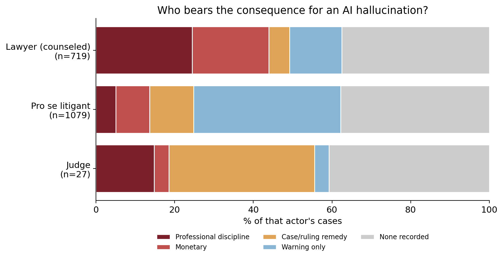

# Who Gets Punished for AI Hallucinations?

QSS 20 (Modern Statistical Computing) final project. Jude Poirier.

This project asks what happens to someone who files a court document containing a fabricated,
AI-generated citation, and whether the outcome depends on who filed it. The data come from Damien
Charlotin's [AI Hallucination Cases Database](https://www.damiencharlotin.com/hallucinations/).
Three kinds of filers show up often enough to compare: attorneys, self-represented (pro se)
litigants, and judges. They are treated very differently. Roughly a quarter of attorney cases end
in some form of personal professional discipline. Pro se litigants usually get a warning and not
much more. When the hallucination comes from the bench, the court tends to fix the ruling and leave
the judge alone. That pattern says something specific about how sanctions work. The court's tools
are built around lawyers, so when the responsible party sits outside the bar there is little for the
system to grab onto.

## Headline finding



The figure covers 719 attorney cases, 1,079 pro se cases, and 27 judge cases, and for each group it
shows the most serious personal consequence on record. An ordered logistic regression supports the
litigant comparison. Pro se filers have about a third the odds of a counseled filer of reaching a
higher severity tier (odds ratio 0.32, 95% CI 0.25 to 0.41), and the result survives clustering the
standard errors by court. A separate machine-learning pass shows that severity is hard to predict
from case features at all. The only two variables carrying real weight are whether the filer was pro
se and whether the AI tool was named.

## Repository layout

```
qss20-ai-hallucinations/
├── code/
│   ├── 00_pull.ipynb      load raw CSV, profile missingness -> data/raw.pkl
│   ├── 01_clean.ipynb     severity/actor/feature coding + court-caseload merge -> data/clean.pkl
│   └── 02_analyze.ipynb   accountability gradient, ordered logit, supervised ML
├── data/
│   └── Charlotin-hallucination_cases.csv   raw download (source linked above)
└── output/
    ├── fig_accountability_gradient.png
    ├── fig_severity_dist.png
    ├── fig_forest.png
    ├── fig_ml_importance.png
    └── fig_ml_confusion.png
```

## Notebooks (run in order)

| Notebook | Input | What it does | Output |
|---|---|---|---|
| `00_pull.ipynb`  | `data/Charlotin-hallucination_cases.csv` | Loads the database, then prints shape, columns, and per-column missingness. | `data/raw.pkl` |
| `01_clean.ipynb` | `data/raw.pkl` | Keeps the U.S. cases, codes the severity scale (0 to 4), the actor type, and the model features from the free-text `Outcome`, and merges court-level caseload with before/after diagnostics. | `data/clean.pkl` |
| `02_analyze.ipynb` | `data/clean.pkl`, `data/raw.pkl` | Produces the accountability-gradient figure, a proportional-odds ordered logit with court-clustered standard errors, and a scikit-learn severity classifier with permutation importance. | figures in `output/` |

## Methods used (mapping to course modules)

- Pandas, regex, and user-defined functions do the loading and the severity and actor coding.
- The court-caseload merge in `01` prints row counts before and after, with a check for unmatched keys.
- The supervised ML in `02` trains a scikit-learn severity classifier against a most-frequent baseline and reports permutation importance.
- The ordered logit and its court-clustered standard errors are written directly in NumPy and SciPy.

## Reproducing

```bash
pip install pandas numpy scipy scikit-learn matplotlib
# then run the notebooks in code/ in order: 00, 01, 02
```

Paths are relative to `code/`, and nothing is hardcoded.

## Data

The file in `data/` is a download of the AI Hallucination Cases Database (linked above), about 1,848
rows. This project uses the 1,279 U.S. rows. The database records only hallucination cases that were
caught and written up, which is a sampling limit the paper takes up.

## Status

Milestone 2 scaffold. The three notebooks run from start to finish and rebuild every figure in
`output/`. The severity scale is a keyword reading of the free-text dispositions and still needs
hand-checking against a sample of opinions before the final paper.
