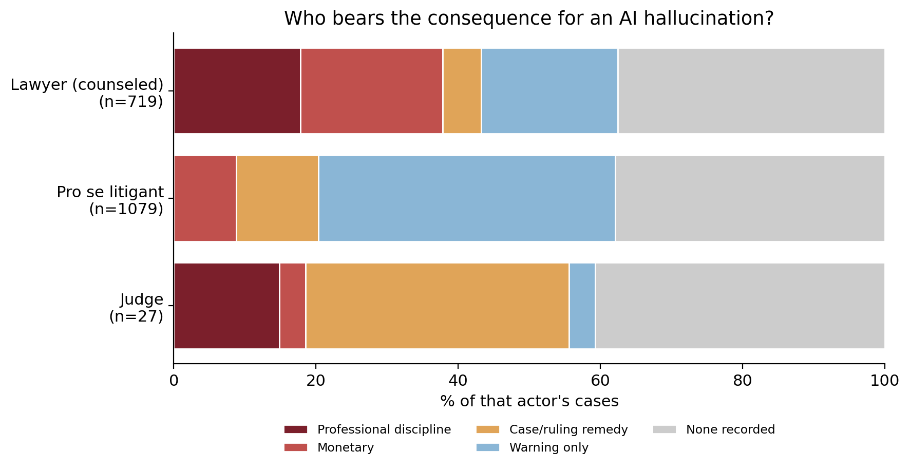

# Who Gets Punished for AI Hallucinations?

**QSS 20 · Modern Statistical Computing · Final Project · Jude Poirier**

When someone files a court document with a fabricated, AI-generated citation, what happens to them,
and does it depend on who they are? This project takes that up using the
[AI Hallucination Cases Database](https://www.damiencharlotin.com/hallucinations/), maintained by
Damien Charlotin, plus a non-AI control group built from
[CourtListener](https://www.courtlistener.com/help/api/bulk-data/) bulk data.

Three kinds of filers show up often enough to compare: attorneys, self-represented (pro se)
litigants, and judges. The courts treat them very differently. About a quarter of the attorney
cases end in personal professional discipline. Pro se litigants tend to draw a warning and not much
more. When the fabrication comes from the bench, the usual response is to fix the ruling and leave
the judge alone. The pattern points at how sanctions actually work. The machinery is built around
lawyers, so when the responsible party sits outside the bar there is little for it to grab.

## Headline finding



Across 719 attorney cases, 1,079 pro se cases, and 27 judge cases, the figure shows the most
serious personal consequence on record for each group. An ordered logistic regression backs up the
litigant comparison. Pro se filers have roughly a third the odds of a counseled filer of reaching a
higher severity tier (odds ratio 0.32, 95% CI 0.25 to 0.41), and the result holds after clustering
standard errors by court. A machine-learning pass finds that severity is barely predictable from
case features at all. The only two variables that carry real weight are whether the filer was pro
se and whether the AI tool was named.

## The comparison arm

Charlotin's database only records cases where AI-fabricated material was found, so on its own it
can't say whether AI cases are handled differently from ordinary sanctions cases. To get at that,
the project builds a non-AI control group from CourtListener: 2023 to 2026 opinions that ruled on a
Rule 11 / §1927 / inherent-authority sanctions question, with criminal community-control
sentencing, licensing-board discipline, and standalone bar-discipline proceedings filtered out. The
two arms get pooled and compared with an OLS model on severity.

Read that comparison as associational. It carries a base-rate caveat worth stating plainly. The AI
arm is a curated set, meaning cases where something happened, and the controls are trigger-matched
opinions that are mostly non-events. Cleaner coding does not fix that gap. See
[`docs/VALIDATION.md`](docs/VALIDATION.md) for how the control coding was validated and where it
falls short.

## Repository layout

```
qss20-ai_hallucinations_project/
├── README.md                    <- you are here
├── code/                        <- the analysis pipeline, run 00 to 05
│   ├── README.md
│   ├── 00_pull.ipynb
│   ├── 01_clean.ipynb
│   ├── 02_build_controls.ipynb
│   ├── 03_build_pooled.ipynb
│   ├── 04_analyze.ipynb
│   ├── 05_validate_controls.ipynb
│   └── labeling/                <- coding toolkit the notebooks import
│       ├── README.md
│       ├── label_lib.py
│       ├── make_handcoding_sample.py
│       ├── validate_coding.py
│       ├── validate_llm.py
│       └── llm_coder.py
├── data/                        <- git-ignored; see "Data" below
│   ├── README.md
│   ├── DOWNLOAD_LINKS.md
│   ├── raw/
│   │   └── bulk-data/           <- 2.3 GB CourtListener snapshot
│   ├── interim/                 <- rebuildable .pkl files
│   └── coded/                   <- analysis-ready CSVs
├── docs/
│   ├── README.md
│   ├── LABELING_CODEBOOK.md      <- decision rules behind every coded variable
│   ├── VALIDATION.md             <- how the coding was validated, and its limits
│   └── CONTROL_CODING_BRIEF.txt  <- brief for coding controls with an LLM
└── output/
    ├── README.md
    ├── figures/
    └── tables/
```

Each folder carries its own `README.md`.

## Notebooks

Run them in numeric order. Each one reads what an earlier one wrote. Every path is relative to
`code/`, so launch Jupyter from there.

| # | Notebook | Input | What it does | Output |
|---|---|---|---|---|
| 00 | `code/00_pull.ipynb` | `data/raw/Charlotin-hallucination_cases.csv` | Loads the database and profiles it: shape, columns, per-column missingness. | `data/interim/raw.pkl` |
| 01 | `code/01_clean.ipynb` | `data/interim/raw.pkl` | Keeps the U.S. cases; codes the 0 to 4 severity scale, actor type, and model features from the free-text `Outcome`; merges court-level caseload with before/after row-count checks. | `data/interim/clean.pkl`, `data/coded/analysis_data_coded.csv` |
| 02 | `code/02_build_controls.ipynb` | `data/raw/bulk-data/` | Streams the CourtListener bulk file in chunks, filters to 2023 to 2026 sanctions rulings, screens out AI-contaminated, bar-discipline, criminal, and licensing cases, and writes each eligible control with a wide text window for coding. | `data/coded/controls_all_fulltext.csv`, `controls_validation_40.csv` |
| (manual) | code the controls with an LLM | `controls_all_fulltext.csv` | Paste `docs/CONTROL_CODING_BRIEF.txt` into a fresh model window, attach the file, save the result. | `data/coded/controls_llm_coded.csv` |
| 03 | `code/03_build_pooled.ipynb` | `controls_all_fulltext.csv`, `controls_llm_coded.csv`, `analysis_data_coded.csv` | Collapses duplicate opinions, drops ineligible controls, stacks them under the AI arm with an `ai` dummy. | `data/coded/pooled_coded.csv` |
| 04 | `code/04_analyze.ipynb` | `data/interim/clean.pkl`, `raw.pkl`, `pooled_coded.csv` | AI-arm figures (accountability gradient, severity by representation, ordered logit, ML classifier) plus the pooled AI-vs-non-AI regression. | figures in `output/figures/` |
| 05 | `code/05_validate_controls.ipynb` | `controls_validation_40_HANDCODED.csv` | Scores the LLM control coder against an independent hand-coded sample; reports Cohen's kappa and a confusion matrix. | `output/figures/fig_validation_confusion.png`, `output/tables/validation_stats.txt` |

The `code/labeling/` module is shared infrastructure. The notebooks import it. It is not itself a
step in the run. See [`code/labeling/README.md`](code/labeling/README.md) and
[`docs/LABELING_CODEBOOK.md`](docs/LABELING_CODEBOOK.md).

## Coding and validation

Both arms use the same 0 to 4 severity scale (0 none, 1 warning, 2 procedural, 3 monetary, 4
professional/terminal). The AI arm is coded from Charlotin's short `Outcome` field, and a regex
coder validated there at Cohen's kappa 0.87.

Coding the controls from full opinions was the hard part. A regex approach stalled at held-out
kappa 0.36, since opinions phrase impositions in many ways and mention "sanction" in passing, so
the controls are coded by an LLM. That coder was checked against an independent hand-coded sample
of 40 controls and came in at Cohen's kappa 0.87 (quadratic-weighted 0.89). The regex coder stays
in `label_lib.py` as the documented first attempt. Full detail lives in
[`docs/VALIDATION.md`](docs/VALIDATION.md).

## Data

No data files are committed. Everything under `data/` is git-ignored. Download links, the column
dictionary, and provenance dates are in [`data/README.md`](data/README.md) and
[`data/DOWNLOAD_LINKS.md`](data/DOWNLOAD_LINKS.md).

| Dataset | Where it goes | Source |
|---|---|---|
| Charlotin AI Hallucination Cases (1,848 rows) | `data/raw/Charlotin-hallucination_cases.csv` | damiencharlotin.com/hallucinations |
| CourtListener `opinion-clusters` snapshot 2026-06-30 (~2.3 GB) | `data/raw/bulk-data/` | courtlistener.com bulk data |
| Coded AI arm (1,279) | `data/coded/analysis_data_coded.csv` | rebuilt by `01` |
| Full-text controls plus LLM codes | `data/coded/controls_all_fulltext.csv`, `controls_llm_coded.csv` | `02` plus manual coding |
| Pooled AI and control file | `data/coded/pooled_coded.csv` | rebuilt by `03` |

## Methods used (mapping to course modules)

- Pandas, regex, and user-defined functions for loading and for severity and actor coding.
- Merging in `01`, which prints row counts before and after, asserts the count is unchanged, and
  checks for unmatched keys.
- Chunked I/O at scale in `02`, which streams a 2.3 GB compressed file in 100k-row chunks instead
  of loading it into memory, printing a filter funnel at each stage.
- Supervised ML in `04`, a scikit-learn severity classifier scored against a most-frequent baseline
  with permutation importance and a normalized confusion matrix.
- Statistics from scratch: the ordered logit with court-clustered standard errors and the pooled
  OLS are written directly in NumPy and SciPy.
- Measurement validation in `05`, scoring the LLM control coder against an independent hand-coded
  sample and reporting Cohen's kappa (0.87).

## Reproducing

```bash
pip install pandas numpy scipy scikit-learn matplotlib
# run the notebooks in code/ in order: 00, 01, 02, then LLM-code, then 03, 04, 05
```

Notebook `02` needs the CourtListener bulk file and `03` needs the LLM-coded controls. The rest run
against what the earlier notebooks produce. The AI-arm analysis (`00`, `01`, and `04` sections A to
D) runs on the committed Charlotin data alone.

## Limitations

- The findings are associational. Representation and AI use are not randomly assigned.
- Both arms only capture fabrications that were detected and written up.
- The comparison has a base-rate asymmetry between the curated AI arm and the trigger-matched
  controls. This sits in the study design, apart from coding quality.
- CourtListener rarely records representation, so `pro_se` works as a control variable only on the
  AI arm.
